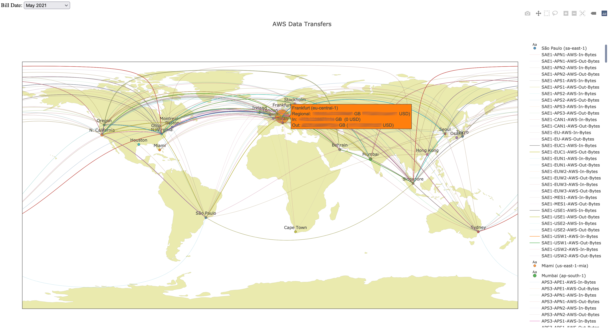

# The AWS Data Transfer Cost Explorer

The AWS Data Transfer Cost Explorer tool analyzes the billed Data Transfer items in your AWS account and presents them visualized on a map.

### Motivation;

We have a continuous cost optimization case on AWS. Especially the Data Transfer tab on the Bills screen is quite long and it takes a long time to understand which areas are used more.

Another need is to catch unusual Data Transfers in our infrastructure. For example, in our infrastructure, it is not possible to get traffic from Tokyo to Sao Paulo, but thanks to this tool, we can see and solve it. 

General:


Filtered:


Bubble Charts for Data Transfers:


Sunburst for Regions:


## Binaries

* [awsdtc_darwin_amd64](https://github.com/c1982/awsdtc/releases) 
* [awsdtc_linux_amd64](https://github.com/c1982/awsdtc/releases) 
* [awsdtc_windows_amd64](https://github.com/c1982/awsdtc/releases) 

## Configuration

* set AWS credentials in `~/.aws/credentials` file

```ini
[default]
aws_access_key_id = A******************U
aws_secret_access_key = WD/**********************************MA
```

or

* set AWS credentials system environment

```bash
export AWS_ACCESS_KEY_ID=A******************U
export AWS_SECRET_ACCESS_KEY=WD/**********************************MA
```

## Policy

```json
{
    "Version": "2012-10-17",
    "Statement": [
        {
            "Effect": "Allow",
            "Action": [
                "aws-portal:ViewUsage",
                "aws-portal:ViewBilling",
                "cur:DescribeReportDefinitions",
                "ce:GetCostAndUsage"
            ],
            "Resource": "*"
        }
    ]
}
```

## Running

1. [Download Binary](https://github.com/c1982/awsdtc/releases) for your OS
2. Run awsdtc executable in Command Line
3. And call in your browser http://localhost:8080

## License

Distributed under the MIT License. See `LICENSE` for more information.

## Contact

Oğuzhan YILMAZ - [@c1982](https://twitter.com/c1982) - aspsrc@gmail.com